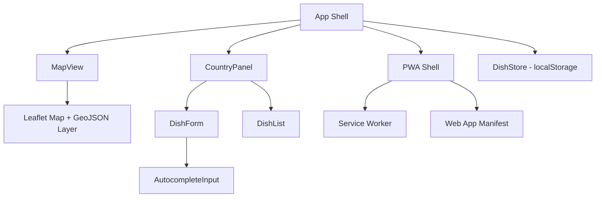
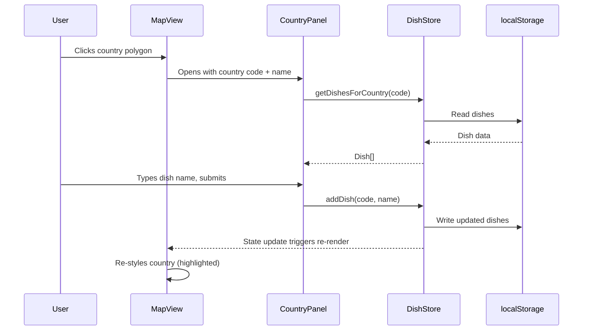

# Design Document

## Overview

Cooking World Map is a client-side Progressive Web App built with React, Vite, and Leaflet. The app renders an interactive choropleth-style world map using GeoJSON country boundaries. Users click a country polygon to open a side panel where they can add, view, and delete dishes. All data is persisted in the browser's `localStorage`. A service worker and web app manifest enable PWA installation and offline shell loading.

### Key Technology Choices

| Concern | Choice | Rationale |
|---|---|---|
| Framework | React 18 + Vite | Fast dev experience, wide ecosystem, simple SPA setup |
| Map | Leaflet + react-leaflet | Lightweight, mobile-friendly, excellent GeoJSON support with per-feature click handlers |
| Country data | Natural Earth GeoJSON (110m) | Freely available, small file size (~200KB), sufficient detail for country-level interaction |
| Persistence | localStorage | No backend needed for a two-person app; simple key-value storage |
| PWA | vite-plugin-pwa (Workbox) | Generates service worker and manifest with minimal config |
| Styling | CSS Modules | Scoped styles, no extra dependency |

### Design Decisions

1. **No backend server** — The app is for a couple sharing a single device/browser. localStorage is sufficient and avoids hosting costs.
2. **GeoJSON overlay instead of tile-based country detection** — Rendering country polygons from GeoJSON gives precise click targets and easy styling for the "has dishes" highlight. A tile layer provides the base map underneath.
3. **Single data store keyed by ISO country code** — Each country is identified by its ISO 3166-1 alpha-3 code from the GeoJSON properties, making lookups O(1).
4. **Autocomplete from global dish list** — Suggestions come from all dishes across all countries, not just the selected country, so the couple can reuse dish names easily.

## Architecture



The app follows a simple component architecture with a shared data store:

1. **App Shell** — Root component. Manages selected country state and provides the DishStore context.
2. **MapView** — Renders the Leaflet map with a GeoJSON overlay. Handles zoom, pan, and country click events. Highlights countries that have dishes.
3. **CountryPanel** — Slide-in panel triggered by country selection. Contains the DishForm and DishList for the selected country.
4. **DishForm + AutocompleteInput** — Input field with autocomplete dropdown. Validates non-empty input before submission.
5. **DishList** — Displays dishes for the selected country with delete buttons.
6. **DishStore** — A React context + custom hook wrapping localStorage read/write operations. Single source of truth for all dish data.
7. **PWA Shell** — Service worker registration and manifest configuration via vite-plugin-pwa.

### Data Flow



## Components and Interfaces

### App (Root Component)

```typescript
// State
interface AppState {
  selectedCountry: { code: string; name: string } | null;
}

// The App component renders MapView and conditionally renders CountryPanel
// It provides DishStoreProvider context to all children
```

### MapView

```typescript
interface MapViewProps {
  onCountrySelect: (country: { code: string; name: string }) => void;
  countriesWithDishes: Set<string>; // ISO alpha-3 codes
}

// Renders:
// - MapContainer with TileLayer (OpenStreetMap)
// - GeoJSON layer with country polygons
// - Per-feature style function: highlighted fill for countries in countriesWithDishes
// - Per-feature onClick handler: extracts country code/name, calls onCountrySelect
```

### CountryPanel

```typescript
interface CountryPanelProps {
  country: { code: string; name: string };
  onClose: () => void;
}

// Renders:
// - Country name header
// - DishForm for adding new dishes
// - DishList showing existing dishes with delete actions
```

### DishForm

```typescript
interface DishFormProps {
  countryCode: string;
  onDishAdded: () => void;
}

// Contains AutocompleteInput
// Validates non-empty trimmed input
// Calls DishStore.addDish on submit
// Clears input on success
```

### AutocompleteInput

```typescript
interface AutocompleteInputProps {
  value: string;
  onChange: (value: string) => void;
  onSelect: (suggestion: string) => void;
  suggestions: string[];
}

// Renders:
// - Text input field
// - Dropdown list of filtered suggestions
// - Keyboard and click selection support
```

### DishList

```typescript
interface DishListProps {
  dishes: Dish[];
  onDelete: (dishId: string) => void;
}

// Renders each dish with name and a delete button
// Delete triggers confirmation then calls onDelete
```

### DishStore (Context + Hook)

```typescript
interface Dish {
  id: string;        // UUID
  name: string;      // Dish name
  countryCode: string; // ISO 3166-1 alpha-3
  createdAt: string; // ISO 8601 timestamp
}

interface DishStoreContextValue {
  dishes: Dish[];
  getDishesForCountry: (countryCode: string) => Dish[];
  addDish: (countryCode: string, name: string) => void;
  deleteDish: (dishId: string) => void;
  getAllDishNames: () => string[];
  getCountriesWithDishes: () => Set<string>;
}

// Implementation:
// - Reads from localStorage on mount
// - Writes to localStorage on every mutation
// - Throws/catches errors and surfaces them via state
```

## Data Models

### Dish

| Field | Type | Description |
|---|---|---|
| id | string (UUID) | Unique identifier for the dish |
| name | string | Name of the dish (trimmed, non-empty) |
| countryCode | string | ISO 3166-1 alpha-3 country code |
| createdAt | string | ISO 8601 creation timestamp |

### localStorage Schema

**Key:** `cooking-world-map-dishes`

**Value:** JSON-serialized `Dish[]`

```json
[
  {
    "id": "a1b2c3d4-...",
    "name": "Pad Thai",
    "countryCode": "THA",
    "createdAt": "2024-06-15T10:30:00.000Z"
  }
]
```

### GeoJSON Country Properties (from Natural Earth)

The GeoJSON features include properties used for identification and display:

| Property | Usage |
|---|---|
| `ISO_A3` | Country code for data lookup |
| `ADMIN` or `NAME` | Display name shown in CountryPanel header |


## Correctness Properties

*A property is a characteristic or behavior that should hold true across all valid executions of a system — essentially, a formal statement about what the system should do. Properties serve as the bridge between human-readable specifications and machine-verifiable correctness guarantees.*

### Property 1: Country highlight style correctness

*For any* set of country codes that have dishes and *for any* country code, the map style function SHALL return the highlighted style if and only if the country code is in the set of countries with dishes, and the default style otherwise.

**Validates: Requirements 1.5**

### Property 2: Add dish and retrieve by country

*For any* valid dish name and *for any* country code, after adding the dish to that country, `getDishesForCountry` SHALL return a list that contains the newly added dish and all previously existing dishes for that country, with no dishes lost or duplicated.

**Validates: Requirements 2.2, 2.3**

### Property 3: Whitespace-only dish names are rejected

*For any* string composed entirely of whitespace characters (including empty string), attempting to add it as a dish name SHALL be rejected, and the dish list SHALL remain unchanged.

**Validates: Requirements 2.4**

### Property 4: Autocomplete case-insensitive substring filter

*For any* non-empty search string and *for any* list of dish names, the autocomplete filter SHALL return exactly those dish names that contain the search string as a substring when compared case-insensitively.

**Validates: Requirements 3.1, 3.2**

### Property 5: Dish persistence round-trip

*For any* list of valid dishes, serializing them to localStorage and then deserializing on app load SHALL produce an equivalent list with all fields (id, name, countryCode, createdAt) preserved.

**Validates: Requirements 4.1, 4.2**

### Property 6: Delete dish removes from store and updates country set

*For any* dish that exists in the store, after deleting it, the dish SHALL no longer appear in `getDishesForCountry` for its country, and if it was the last dish for that country, the country SHALL no longer appear in `getCountriesWithDishes`.

**Validates: Requirements 6.2, 6.3**

## Error Handling

| Scenario | Handling |
|---|---|
| localStorage write fails (quota exceeded) | Catch the error in DishStore, set an error state, display a toast/banner message to the user (Req 4.3) |
| localStorage read fails or returns invalid JSON | Fall back to an empty dish list, log a warning to the console |
| GeoJSON fails to load | Display an error overlay on the map area with a retry option |
| Country click on ocean/non-country area | No-op — the GeoJSON click handler only fires on country features |
| Empty or whitespace-only dish name submission | Show inline validation message below the input field, do not add the dish (Req 2.4) |
| Duplicate dish name for same country | Allowed — users may cook the same dish multiple times |

## Testing Strategy

### Unit Tests (Example-Based)

Unit tests cover specific scenarios, UI interactions, and edge cases:

- **Map rendering**: Verify MapContainer and GeoJSON layer render with country features (Req 1.1)
- **Map configuration**: Verify zoom and drag are enabled (Req 1.2, 1.3, 1.4)
- **Country click → panel open**: Simulate GeoJSON feature click, verify CountryPanel renders with correct country name (Req 2.1)
- **Reactive UI update**: Add a dish, verify DishList re-renders with the new dish (Req 2.5)
- **Autocomplete selection**: Click a suggestion, verify input is populated (Req 3.3)
- **Autocomplete empty input**: Verify no suggestions shown when input is empty (Req 3.5)
- **Autocomplete no matches**: Verify empty suggestions when no dishes match (Req 3.4)
- **localStorage failure**: Mock localStorage.setItem to throw, verify error message (Req 4.3)
- **Delete button presence**: Render DishList, verify each dish has a delete action (Req 6.1)

### Property-Based Tests

Property-based tests verify universal correctness properties across many generated inputs. Each test runs a minimum of 100 iterations using [fast-check](https://github.com/dubzzz/fast-check).

| Test | Property | Tag |
|---|---|---|
| Style function correctness | Property 1 | Feature: cooking-world-map, Property 1: Country highlight style correctness |
| Add and retrieve dishes | Property 2 | Feature: cooking-world-map, Property 2: Add dish and retrieve by country |
| Whitespace rejection | Property 3 | Feature: cooking-world-map, Property 3: Whitespace-only dish names are rejected |
| Autocomplete filter | Property 4 | Feature: cooking-world-map, Property 4: Autocomplete case-insensitive substring filter |
| Persistence round-trip | Property 5 | Feature: cooking-world-map, Property 5: Dish persistence round-trip |
| Delete and update state | Property 6 | Feature: cooking-world-map, Property 6: Delete dish removes from store and updates country set |

### Smoke Tests

- PWA manifest contains required fields: name, icons, theme_color, display: standalone (Req 5.1, 5.3)
- Service worker registration is configured (Req 5.2)
- Static asset precaching is configured (Req 5.4)

### Test Tooling

- **Test runner**: Vitest (integrates with Vite)
- **Component testing**: React Testing Library
- **Property-based testing**: fast-check
- **localStorage mock**: Vitest's `vi.spyOn` on `Storage.prototype`
