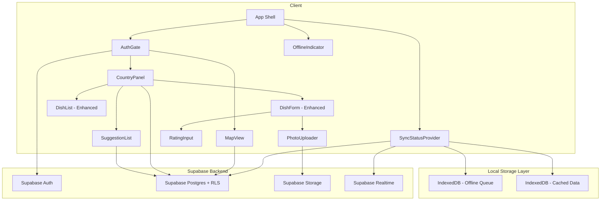
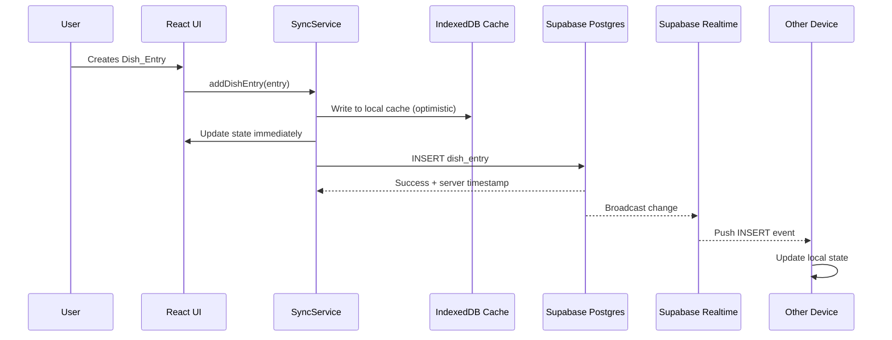
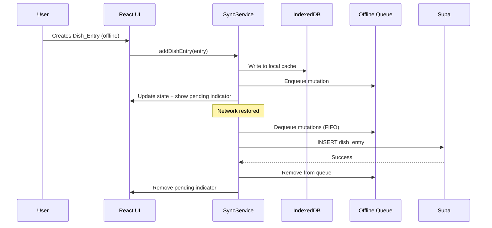
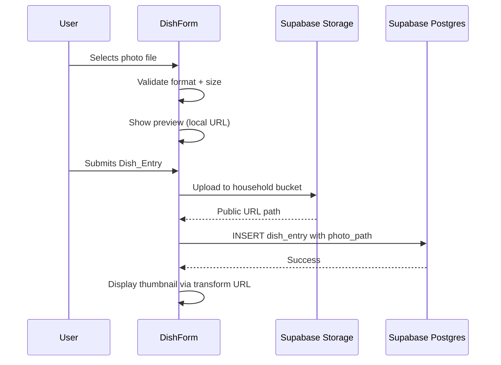

# Design Document

## Overview

Enhanced Dish Tracking transforms the Cooking World Map from a single-device localStorage app into a cloud-synced, mobile-first experience for a couple. The upgrade introduces Supabase as the backend platform (Postgres + Auth + Storage + Realtime), rich dish entries with photos/ratings/ingredients, popular dish suggestions with rotation logic, offline-first architecture with IndexedDB queuing, and a responsive mobile-first UI with bottom sheet patterns.

### Key Technology Choices

| Concern | Choice | Rationale |
|---|---|---|
| Backend | Supabase (Postgres + Auth + Storage + Realtime) | Single platform provides auth, database, file storage, and real-time subscriptions — minimal infrastructure to manage |
| Authentication | Supabase Auth (email/password) | Built-in session management, JWT tokens, integrates with RLS policies |
| Database | Supabase Postgres with RLS | Row Level Security scopes all queries to the user's household without application-level checks |
| Photo Storage | Supabase Storage with Image Transformations | On-the-fly thumbnail generation via URL parameters, private bucket with RLS |
| Real-time Sync | Supabase Realtime (Postgres Changes) | WebSocket subscriptions push INSERT/UPDATE/DELETE events to all connected household members |
| Offline Queue | IndexedDB (via idb-keyval or raw API) | Structured storage for pending mutations; survives page reloads unlike in-memory queues |
| PWA | vite-plugin-pwa (Workbox) | Existing setup; extended with runtime caching for Supabase API responses |
| UI Pattern | Bottom sheet (mobile), side panel (desktop) | Standard mobile pattern for contextual content; preserves existing desktop layout |
| Popular Dishes | Seeded Postgres table | Curated dataset loaded via migration; queried with RLS allowing public read |

### Design Decisions

1. **Household as tenant** — RLS policies use `household_id` as the tenant key. Both users in a couple share a household, and all data is scoped to it. This avoids complex per-user permissions while ensuring data isolation between households.
2. **Optimistic UI with offline queue** — Mutations update local state immediately, then sync to Supabase. If offline, mutations are queued in IndexedDB and replayed on reconnect. This keeps the app feeling instant regardless of network state.
3. **Last-write-wins conflict resolution** — Each mutation carries a client-side timestamp. On sync conflicts (same dish edited on two devices simultaneously), the most recent timestamp wins. This is simple and acceptable for a two-person app.
4. **Supabase Image Transformations for thumbnails** — Rather than generating thumbnails server-side on upload, we use Supabase's on-the-fly image transformation via URL query parameters (`?width=400`). This avoids custom Edge Functions and simplifies the upload flow.
5. **Suggestion rotation via exclusion query** — Instead of maintaining a separate "shown suggestions" state, we query popular dishes WHERE the dish name is NOT IN the household's cooked dishes for that country. This is stateless and always correct.
6. **Data migration as one-time prompt** — Existing localStorage data is migrated to the cloud on first authenticated login. The migration is idempotent (skips already-migrated entries) and removes localStorage data only on success.

## Architecture



### Data Flow — Online Mutation



### Data Flow — Offline Mutation



### Data Flow — Photo Upload



## Components and Interfaces

### Updated Type Definitions

```typescript
// src/types/DishEntry.ts
export interface DishEntry {
  id: string;                  // UUID (generated client-side for offline support)
  household_id: string;        // FK to households table
  country_code: string;        // ISO 3166-1 alpha-3
  name: string;                // Dish name (trimmed, 1-100 chars)
  rating: number | null;       // 1-10 inclusive, null for migrated entries
  photo_path: string | null;   // Storage path (e.g., "household-id/dish-id.jpg")
  ingredients: string[];       // Array of ingredient strings (max 50 items)
  notes: string | null;        // Free text (max 1000 chars)
  recipe_link: string | null;  // Valid URL or null
  created_at: string;          // ISO 8601 timestamp
  updated_at: string;          // ISO 8601 timestamp
  created_by: string;          // User ID who created the entry
  sync_status: SyncStatus;     // Client-only field, not persisted to DB
}

export type SyncStatus = 'synced' | 'pending' | 'error';

export interface PopularDish {
  id: string;                  // UUID
  country_code: string;        // ISO 3166-1 alpha-3
  name: string;                // Dish name
  recipe_link: string;         // URL to recipe
  sort_order: number;          // Order within country for rotation
}

export interface Household {
  id: string;                  // UUID
  created_at: string;          // ISO 8601
  invite_code: string | null;  // Active invite code
  invite_expires_at: string | null; // Expiry timestamp
}

export interface HouseholdMember {
  id: string;                  // UUID
  household_id: string;        // FK to households
  user_id: string;             // FK to auth.users
  joined_at: string;           // ISO 8601
}
```

### AuthGate Component

```typescript
interface AuthGateProps {
  children: React.ReactNode;
}

// Renders sign-in/sign-up form when no session exists
// Renders children when authenticated
// Handles invite code flow for joining a household
```

### Enhanced CountryPanel

```typescript
interface CountryPanelProps {
  country: { code: string; name: string };
  onClose: () => void;
}

// Mobile (<768px): Renders as bottom sheet (90%+ viewport height)
// Desktop (>=768px): Renders as side panel (320-480px wide)
// Contains: SuggestionList, DishForm, DishList
```

### Enhanced DishForm

```typescript
interface DishFormProps {
  countryCode: string;
  onDishAdded: () => void;
}

// Fields: name (required), rating (required, 1-10), photo (optional),
//         ingredients (optional, comma/line separated, max 50),
//         notes (optional, max 1000 chars), recipe_link (optional, validated URL)
// Validates all fields before submission
// Shows photo preview when image selected
// Handles upload errors with retry option
```

### PhotoUploader Component

```typescript
interface PhotoUploaderProps {
  onPhotoSelected: (file: File) => void;
  onPhotoRemoved: () => void;
  previewUrl: string | null;
  error: string | null;
}

// Accepts JPEG, PNG, WebP only
// Rejects files > 10MB
// Shows preview of selected image
// Provides remove/change actions
```

### RatingInput Component

```typescript
interface RatingInputProps {
  value: number | null;
  onChange: (rating: number) => void;
  required?: boolean;
}

// Renders 1-10 numeric selector
// Constrains to whole numbers
// Touch-friendly (44x44px targets)
```

### SuggestionList Component

```typescript
interface SuggestionListProps {
  countryCode: string;
}

// Fetches up to 3 uncooked popular dishes for the country
// Renders dish name + recipe link for each
// Hidden entirely when no suggestions available
// Links open in new tab
```

### DishEntryCard Component

```typescript
interface DishEntryCardProps {
  entry: DishEntry;
  onDelete: (id: string) => void;
  expanded: boolean;
  onToggle: () => void;
}

// Summary view: name, rating (X/10), thumbnail (80x80), date
// Expanded view: + ingredients, notes, recipe link
// Shows sync status indicator when pending/error
// Placeholder image when no photo
```

### SyncService (Hook)

```typescript
interface SyncServiceValue {
  isOnline: boolean;
  pendingCount: number;
  addDishEntry: (entry: Omit<DishEntry, 'id' | 'household_id' | 'created_at' | 'updated_at' | 'created_by' | 'sync_status'>) => Promise<DishEntry>;
  deleteDishEntry: (id: string) => Promise<void>;
  getDishEntriesForCountry: (countryCode: string) => DishEntry[];
  getCountriesWithDishes: () => Set<string>;
  getSuggestionsForCountry: (countryCode: string) => PopularDish[];
  uploadPhoto: (file: File) => Promise<string>; // Returns storage path
}

// Manages optimistic updates, offline queue, and realtime subscriptions
// Provides household-scoped data access
// Handles conflict resolution (last-write-wins)
```

### OfflineIndicator Component

```typescript
// Renders a persistent banner when navigator.onLine is false
// Disappears when connectivity restored and queue is empty
// Shows "Syncing..." state while queue is being processed
```

### MigrationPrompt Component

```typescript
interface MigrationPromptProps {
  onConfirm: () => void;
  onDismiss: () => void;
  progress: { migrated: number; total: number } | null;
}

// Shown when localStorage has existing dish data
// Displays progress during migration
// Handles success/failure states
```

## Data Models

### Database Schema (Supabase Postgres)

```sql
-- Households table
CREATE TABLE households (
  id UUID PRIMARY KEY DEFAULT gen_random_uuid(),
  created_at TIMESTAMPTZ NOT NULL DEFAULT now(),
  invite_code TEXT UNIQUE,
  invite_expires_at TIMESTAMPTZ
);

-- Household members (max 2 per household)
CREATE TABLE household_members (
  id UUID PRIMARY KEY DEFAULT gen_random_uuid(),
  household_id UUID NOT NULL REFERENCES households(id) ON DELETE CASCADE,
  user_id UUID NOT NULL REFERENCES auth.users(id) ON DELETE CASCADE,
  joined_at TIMESTAMPTZ NOT NULL DEFAULT now(),
  UNIQUE(household_id, user_id)
);

-- Dish entries (the core data)
CREATE TABLE dish_entries (
  id UUID PRIMARY KEY DEFAULT gen_random_uuid(),
  household_id UUID NOT NULL REFERENCES households(id) ON DELETE CASCADE,
  country_code TEXT NOT NULL,
  name TEXT NOT NULL CHECK (char_length(trim(name)) > 0 AND char_length(name) <= 100),
  rating INTEGER CHECK (rating >= 1 AND rating <= 10),
  photo_path TEXT,
  ingredients TEXT[] DEFAULT '{}' CHECK (array_length(ingredients, 1) IS NULL OR array_length(ingredients, 1) <= 50),
  notes TEXT CHECK (notes IS NULL OR char_length(notes) <= 1000),
  recipe_link TEXT CHECK (recipe_link IS NULL OR recipe_link ~ '^https?://'),
  created_at TIMESTAMPTZ NOT NULL DEFAULT now(),
  updated_at TIMESTAMPTZ NOT NULL DEFAULT now(),
  created_by UUID NOT NULL REFERENCES auth.users(id)
);

-- Popular dishes (seeded, read-only for users)
CREATE TABLE popular_dishes (
  id UUID PRIMARY KEY DEFAULT gen_random_uuid(),
  country_code TEXT NOT NULL,
  name TEXT NOT NULL,
  recipe_link TEXT NOT NULL,
  sort_order INTEGER NOT NULL DEFAULT 0
);

-- Indexes
CREATE INDEX idx_dish_entries_household_country ON dish_entries(household_id, country_code);
CREATE INDEX idx_dish_entries_household ON dish_entries(household_id);
CREATE INDEX idx_popular_dishes_country ON popular_dishes(country_code, sort_order);
CREATE INDEX idx_household_members_user ON household_members(user_id);
```

### Row Level Security Policies

```sql
-- Households: members can read their own household
ALTER TABLE households ENABLE ROW LEVEL SECURITY;
CREATE POLICY "Members can view own household" ON households
  FOR SELECT USING (
    id IN (SELECT household_id FROM household_members WHERE user_id = auth.uid())
  );

-- Household members: can view members of own household
ALTER TABLE household_members ENABLE ROW LEVEL SECURITY;
CREATE POLICY "Members can view own household members" ON household_members
  FOR SELECT USING (
    household_id IN (SELECT household_id FROM household_members WHERE user_id = auth.uid())
  );

-- Dish entries: full CRUD scoped to household
ALTER TABLE dish_entries ENABLE ROW LEVEL SECURITY;
CREATE POLICY "Household members can CRUD dish entries" ON dish_entries
  FOR ALL USING (
    household_id IN (SELECT household_id FROM household_members WHERE user_id = auth.uid())
  );

-- Popular dishes: public read access
ALTER TABLE popular_dishes ENABLE ROW LEVEL SECURITY;
CREATE POLICY "Anyone can read popular dishes" ON popular_dishes
  FOR SELECT USING (true);
```

### Supabase Storage Configuration

- **Bucket name:** `dish-photos`
- **Access:** Private (RLS-protected)
- **Policy:** Only household members can upload/read photos in their household's folder
- **Path convention:** `{household_id}/{dish_entry_id}.{ext}`
- **Thumbnail access:** Via Supabase Image Transformations URL parameter `?width=400`
- **Accepted formats:** JPEG, PNG, WebP
- **Max file size:** 10MB (enforced client-side and via storage policy)

### Offline Queue Schema (IndexedDB)

```typescript
interface QueuedMutation {
  id: string;              // UUID
  type: 'INSERT' | 'UPDATE' | 'DELETE';
  table: 'dish_entries';
  payload: Partial<DishEntry>;
  timestamp: string;       // ISO 8601 (for conflict resolution)
  retryCount: number;
  photoFile?: Blob;        // Stored blob for offline photo uploads
}
```

### IndexedDB Stores

| Store | Key | Purpose |
|---|---|---|
| `dish_entries_cache` | `id` | Local cache of all household dish entries |
| `mutation_queue` | `id` | Pending mutations to sync |
| `popular_dishes_cache` | `id` | Cached popular dishes (refreshed on login) |


## Correctness Properties

*A property is a characteristic or behavior that should hold true across all valid executions of a system — essentially, a formal statement about what the system should do. Properties serve as the bridge between human-readable specifications and machine-verifiable correctness guarantees.*

### Property 1: Dish name validation

*For any* string, the dish name validation function SHALL accept the string if and only if it is non-empty after trimming whitespace AND its length is at most 100 characters. Strings consisting entirely of whitespace or exceeding 100 characters SHALL be rejected.

**Validates: Requirements 2.2**

### Property 2: Rating constraint

*For any* numeric value, the rating validation function SHALL accept the value if and only if it is a whole number (integer) between 1 and 10 inclusive. Floats, values below 1, and values above 10 SHALL be rejected.

**Validates: Requirements 2.6**

### Property 3: Recipe link validation

*For any* string, the recipe link validation function SHALL accept the string if and only if it begins with `http://` or `https://` and is a well-formed URL. All other strings SHALL be rejected.

**Validates: Requirements 2.7**

### Property 4: Ingredients parsing

*For any* input string, the ingredients parser SHALL split the string by commas or newlines, trim each resulting item, discard empty items, and return at most 50 items. The output array length SHALL never exceed 50, and each item in the output SHALL be a non-empty trimmed string.

**Validates: Requirements 2.10**

### Property 5: Dish entry display completeness

*For any* valid DishEntry object, the summary rendering SHALL include the dish name, numeric rating (X/10), and creation date. When expanded, the rendering SHALL include exactly those optional fields (ingredients, notes, recipe_link) that are non-empty, and SHALL omit sections for empty fields.

**Validates: Requirements 3.1, 3.2**

### Property 6: Dish entries sorted by creation date descending

*For any* list of DishEntry objects for a country, the display order SHALL be sorted by `created_at` in descending order (most recent first). For every adjacent pair (entry[i], entry[i+1]), entry[i].created_at >= entry[i+1].created_at.

**Validates: Requirements 3.6**

### Property 7: Suggestion filtering returns valid bounded subset

*For any* country with N popular dishes and a set of cooked dish names, the suggestion query SHALL return at most 3 PopularDish objects, each having a non-empty `name` and a non-empty `recipe_link`, and none of the returned dishes SHALL have a name that matches (case-insensitive, trimmed) any cooked dish name.

**Validates: Requirements 4.1, 4.2, 5.4**

### Property 8: Suggestion rotation via case-insensitive trimmed match

*For any* dish name string and *for any* PopularDish name, the matching function SHALL return true if and only if the two strings are equal after trimming leading/trailing whitespace and converting to lowercase. This match determines whether a popular dish has been "cooked."

**Validates: Requirements 5.1, 5.3**

### Property 9: Suggestion replacement by sort order

*For any* country with an ordered list of popular dishes and a set of cooked dish names, the suggestions returned SHALL be the first N (up to 3) popular dishes in `sort_order` whose names do NOT match any cooked dish name (using case-insensitive trimmed comparison).

**Validates: Requirements 5.2**

### Property 10: Deleted dish does not restore suggestion

*For any* sequence of operations where a dish matching a popular dish is added and then deleted, the popular dish SHALL NOT reappear in the suggestion list. The suggestion engine SHALL track "ever cooked" status independently of current dish_entries.

**Validates: Requirements 5.5**

### Property 11: Offline queue FIFO ordering

*For any* sequence of mutations created while offline, the offline queue SHALL preserve creation order. When connectivity is restored, mutations SHALL be dequeued and synced in the exact order they were enqueued (first-in, first-out).

**Validates: Requirements 6.5, 9.4**

### Property 12: Last-write-wins conflict resolution

*For any* two mutations targeting the same DishEntry with different timestamps, the conflict resolver SHALL select the mutation with the later timestamp as the winner. The resulting state SHALL reflect the winning mutation's payload.

**Validates: Requirements 6.6**

### Property 13: Thumbnail URL construction

*For any* valid `photo_path` string, the thumbnail URL builder SHALL produce a URL that includes the storage base URL, the photo path, and the width transformation parameter (`width=400`). The constructed URL SHALL be deterministic for the same input.

**Validates: Requirements 7.3**

### Property 14: Photo format validation

*For any* file, the photo validation function SHALL accept the file if and only if its MIME type is one of `image/jpeg`, `image/png`, or `image/webp` AND its size is at most 10MB. Files with other MIME types or exceeding 10MB SHALL be rejected.

**Validates: Requirements 7.4, 7.5, 7.6**

### Property 15: Invite expiry validation

*For any* invite code with a creation timestamp, the invite validity check SHALL return true if and only if the current time is within 48 hours of creation AND the invite has not been previously used. Invites older than 48 hours or already used SHALL be rejected.

**Validates: Requirements 8.4**

### Property 16: Household membership cap

*For any* household, the join operation SHALL succeed if and only if the current member count is less than 2. Attempts to join a household with 2 existing members SHALL be rejected.

**Validates: Requirements 8.8**

### Property 17: Failed sync retry preserves queue

*For any* queued mutation that fails to sync, the mutation SHALL remain in the offline queue with an incremented retry count. The queue length SHALL not decrease on sync failure, and the mutation SHALL be retried on the next connectivity change.

**Validates: Requirements 9.7**

### Property 18: Migration field mapping

*For any* legacy Dish object (with fields: id, name, countryCode, createdAt), the migration mapping function SHALL produce a DishEntry with the same name, countryCode, and createdAt values, and with photo_path=null, ingredients=[], notes=null, recipe_link=null, and rating=null.

**Validates: Requirements 10.5**

### Property 19: Partial migration retry skips already-migrated entries

*For any* set of legacy dishes where a subset has been successfully migrated and the remainder failed, a retry operation SHALL attempt to migrate only the entries not yet present in the cloud database, preserving already-migrated data.

**Validates: Requirements 10.4**

## Error Handling

| Scenario | Handling | Requirement |
|---|---|---|
| Photo upload fails | Display error toast with retry and "submit without photo" options | 2.5 |
| Invalid dish name (empty/whitespace/too long) | Inline validation message below input, prevent submission | 2.2 |
| Invalid rating (out of range) | Constrain input to 1-10 via number input with min/max | 2.6 |
| Invalid recipe link | Inline validation message showing expected format | 2.8 |
| Invalid photo format | Validation message listing accepted formats (JPEG, PNG, WebP) | 7.5 |
| Photo too large (>10MB) | Validation message with size limit | 7.6 |
| Thumbnail fails to load | Display placeholder image at same dimensions | 7.8 |
| Network lost | Show persistent offline indicator banner, queue mutations locally | 9.5 |
| Sync failure after reconnect | Retain in queue, show error indicator on affected entry, auto-retry | 9.7 |
| Sync conflict (simultaneous edits) | Last-write-wins by timestamp, no user intervention needed | 6.6 |
| Sign-in with invalid credentials | Error message with retry option | 8.7 |
| Join full household (2 members) | Error message indicating household is full | 8.8 |
| Invite expired or used | Error message indicating invite is no longer valid | 8.4 |
| Migration failure | Retain localStorage, show error with retry option (skips already-migrated) | 10.4 |
| Supabase service unavailable | Graceful degradation to offline mode with cached data | 6.4 |
| localStorage quota exceeded (legacy) | No longer applicable — data moves to cloud + IndexedDB | — |
| Suggestion recipe link broken | Show dish name with "link unavailable" indicator | 4.6 |

### Error Handling Strategy

1. **Validation errors** — Caught at the form level before submission. Inline messages next to the offending field. No network calls made.
2. **Network errors** — Detected via `navigator.onLine` and fetch error handling. App transitions to offline mode automatically. All mutations queued.
3. **Sync errors** — Individual mutation failures are tracked per-entry. Failed entries show a pending/error indicator. Automatic retry on next connectivity change with exponential backoff (max 3 retries before requiring manual intervention).
4. **Auth errors** — Session expiry triggers re-authentication flow. Cached data remains accessible during re-auth.
5. **Storage errors** — Photo upload failures are isolated from dish entry creation. Users can submit without photo and add it later.

## Testing Strategy

### Unit Tests (Example-Based)

Unit tests cover specific scenarios, UI interactions, and edge cases:

- **Auth gate rendering**: Verify sign-in screen shown when no session (Req 8.1, 8.5)
- **Mobile bottom sheet**: Verify CountryPanel renders as bottom sheet at <768px (Req 1.2)
- **Desktop side panel**: Verify CountryPanel renders as side panel at >=768px (Req 1.4)
- **Close control**: Verify bottom sheet has close button that triggers onClose (Req 1.7)
- **DishForm field presence**: Verify all fields render (name, rating, photo, ingredients, notes, recipe link) (Req 2.1)
- **Photo preview**: Simulate file selection, verify preview renders (Req 2.3)
- **Photo upload error**: Mock upload failure, verify error message and retry/skip options (Req 2.5)
- **Invalid recipe link submission**: Submit with bad URL, verify error message (Req 2.8)
- **Entry collapse/expand toggle**: Tap expanded entry, verify collapse (Req 3.3)
- **Recipe link opens new tab**: Verify anchor with target="_blank" (Req 3.4)
- **Placeholder image**: Render entry without photo, verify placeholder (Req 3.5)
- **Suggestion section hidden**: Render with no suggestions, verify section absent (Req 4.4)
- **Suggestion section heading**: Verify separate labeled section (Req 4.5)
- **Broken suggestion link**: Verify name shown with unavailable indicator (Req 4.6)
- **Pending sync indicator**: Render entry with sync_status='pending', verify indicator (Req 6.8)
- **Offline indicator**: Simulate offline, verify banner shown (Req 9.5)
- **Sync complete indicator removal**: Sync all items, verify banner removed (Req 9.8)
- **Migration prompt shown**: Set localStorage, render authenticated, verify prompt (Req 10.1)
- **Migration prompt dismissed**: Dismiss, reload, verify prompt reappears (Req 10.6)
- **Migration cleanup**: Complete migration, verify localStorage cleared (Req 10.3)
- **Sign-in error**: Submit invalid credentials, verify error message (Req 8.7)
- **Sign-out cleanup**: Sign out, verify IndexedDB cleared (Req 8.6)

### Property-Based Tests

Property-based tests verify universal correctness properties across many generated inputs. Each test runs a minimum of 100 iterations using [fast-check](https://github.com/dubzzz/fast-check).

| Test | Property | Tag |
|---|---|---|
| Dish name validation | Property 1 | Feature: enhanced-dish-tracking, Property 1: Dish name validation |
| Rating constraint | Property 2 | Feature: enhanced-dish-tracking, Property 2: Rating constraint |
| Recipe link validation | Property 3 | Feature: enhanced-dish-tracking, Property 3: Recipe link validation |
| Ingredients parsing | Property 4 | Feature: enhanced-dish-tracking, Property 4: Ingredients parsing |
| Dish entry display completeness | Property 5 | Feature: enhanced-dish-tracking, Property 5: Dish entry display completeness |
| Dish entries sorted descending | Property 6 | Feature: enhanced-dish-tracking, Property 6: Dish entries sorted by creation date descending |
| Suggestion filtering | Property 7 | Feature: enhanced-dish-tracking, Property 7: Suggestion filtering returns valid bounded subset |
| Suggestion match logic | Property 8 | Feature: enhanced-dish-tracking, Property 8: Suggestion rotation via case-insensitive trimmed match |
| Suggestion replacement order | Property 9 | Feature: enhanced-dish-tracking, Property 9: Suggestion replacement by sort order |
| Deleted dish suggestion persistence | Property 10 | Feature: enhanced-dish-tracking, Property 10: Deleted dish does not restore suggestion |
| Offline queue FIFO | Property 11 | Feature: enhanced-dish-tracking, Property 11: Offline queue FIFO ordering |
| Last-write-wins resolution | Property 12 | Feature: enhanced-dish-tracking, Property 12: Last-write-wins conflict resolution |
| Thumbnail URL construction | Property 13 | Feature: enhanced-dish-tracking, Property 13: Thumbnail URL construction |
| Photo format validation | Property 14 | Feature: enhanced-dish-tracking, Property 14: Photo format validation |
| Invite expiry validation | Property 15 | Feature: enhanced-dish-tracking, Property 15: Invite expiry validation |
| Household membership cap | Property 16 | Feature: enhanced-dish-tracking, Property 16: Household membership cap |
| Failed sync retry | Property 17 | Feature: enhanced-dish-tracking, Property 17: Failed sync retry preserves queue |
| Migration field mapping | Property 18 | Feature: enhanced-dish-tracking, Property 18: Migration field mapping |
| Partial migration retry | Property 19 | Feature: enhanced-dish-tracking, Property 19: Partial migration retry skips already-migrated entries |

### Integration Tests

Integration tests verify end-to-end behavior with Supabase services:

- **Real-time sync**: Two authenticated clients, create entry on one, verify appears on other within 5s (Req 6.1)
- **Data persistence**: Create entry, query DB directly, verify all fields stored (Req 6.2)
- **Initial load performance**: Seed 500 entries, measure load time <10s (Req 6.3)
- **RLS enforcement**: Attempt access from non-household user, verify rejection (Req 6.7, 7.7)
- **Photo upload + transform**: Upload image, request thumbnail URL, verify dimensions (Req 7.1, 7.2)
- **Sign-up flow**: Create account, verify household created (Req 8.3)
- **Invite join flow**: Generate invite, join from second account, verify shared data (Req 8.4)
- **Offline photo queue**: Create entry with photo offline, restore, verify upload completes (Req 9.6)

### Smoke Tests

- PWA manifest contains required fields: name, icons, theme_color, display: standalone (Req 9.1)
- Service worker registration is configured with runtime caching for Supabase API
- Supabase client initializes with correct project URL and anon key

### Test Tooling

- **Test runner**: Vitest (integrates with Vite)
- **Component testing**: React Testing Library
- **Property-based testing**: fast-check (already in devDependencies)
- **Supabase mocking**: Custom mock of `@supabase/supabase-js` client for unit/property tests
- **IndexedDB mocking**: fake-indexeddb for offline queue tests
- **Network simulation**: Vitest's `vi.spyOn` on `navigator.onLine` + fetch mocking
- **Integration tests**: Supabase local dev stack (via `supabase start`) for real DB/auth/storage tests
